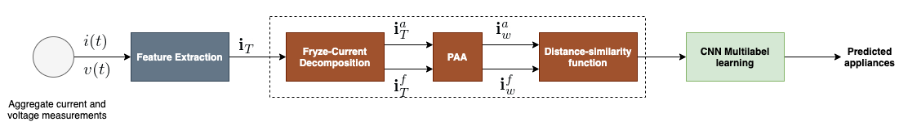
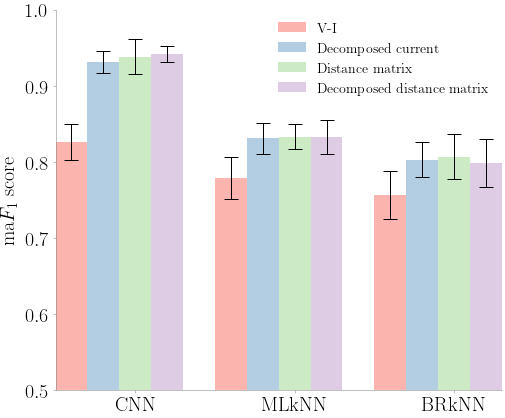
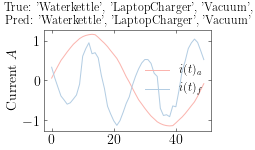
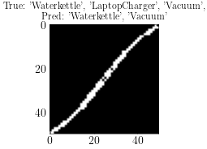
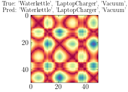

# Multi-label Learning for Appliances Recognition in NILM using Fryze-Current Decomposition and Convolutional Neural Network.

This repository is the official implementation of [Multi-label Learning for Appliances Recognition in NILM using Fryze-Current Decomposition and Convolutional Neural Network](). 



The paper present a multi-label learning strategy for appliance recognition in NILM. The proposed approach associates multiple appliances to an observed aggregate current signal. We first demonstrate that for aggregated measurements, the use of activation current as an input feature offers improved performance compared to the regularly used V-I binary image feature. Second, we apply the Fryze power theory and Euclidean distance matrix as pre-processing steps for the multi-label classifier.
## Requirements

- python
- numpy
- scipy
- pandas
- matplotlib
- tqdm
- torch
- sklearn
- seaborn
- [iterstrat]()
- [skmultilearn]()
- joblib
- [palettable]()
  


## Training

To train the model(s) in the paper, run this command in src directory:

```train
python run_experiment.py
```


## Evaluation

The script used to analyse results and produce visualisation presented in this paper can be found in notebook directory
 
 - ResultsAnalysis notebook provides scripts for results and error analysis.
 - Visual-paper  notebook provide scripts for reproducing most of the figure used in this paper.


## Results

Our model achieves the following performance on PLAID aggregated dataset :




## Prediction sample
<p float="left">
  
  
  
</p>


